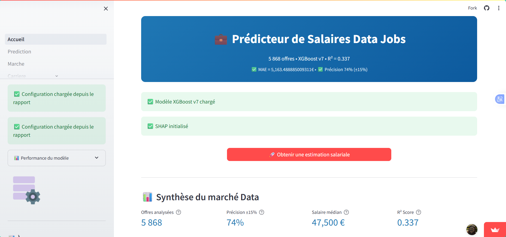
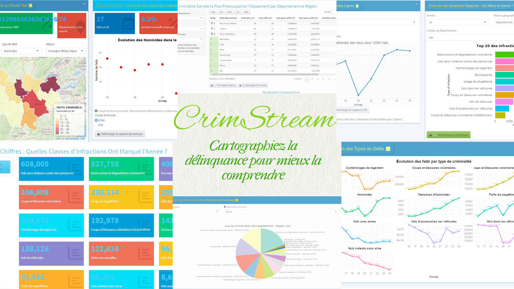

::: {.hero-banner}

<div class="hero-content">
  <h1 class="typewriter rainbow-text">👋 Bienvenue dans mon univers data !</h1>
  Étudiant en Master Économiste d'Entreprise (MÉcEn), je me forme aux métiers  de la science des données (Data Scientist & Data Analyst). Ma formation allie économie, modélisation économétrique, statistiques et machine learning. Sur cette plateforme, je partage mes projets, et ce que j'apprends en analysant comment les données peuvent éclairer les décisions économiques et organisationnelles.
  
  <div class="cta-buttons">
[Mes projets](projects.qmd){.btn .btn-primary .btn-lg role="button"}
[Télécharger mon CV](files/mon_CV.pdf){.btn .btn-outline-secondary .btn-lg role="button"}
  </div>
</div>

<div class="hero-image">
  
  <p class="profile-name">Emmanuel Paguiel BOUENDO</p>
</div>
:::

---

## 🎯 Derniers Projets

<p class="section-lead">Voici quelques travaux récents.</p>

```{=html}
<div class="projects-grid">

  <!-- Projet 1 -->
  <div class="project-card">
    <div class="project-header">
      <h3>💼 Prédicteur de Salaires Data Jobs</h3>
    </div>

    <div class="project-image-container">
      
    </div>

    <div class="project-body">
      <p class="project-description"> Ce projet vise à estimer les salaires dans les métiers de la data à partir de 5 868 offres HelloWork. 
    Il repose sur un modèle XGBoost (R² = 0.337) et permet d'explorer les niveaux de rémunération selon l'expérience, les compétences et la localisation, ainsi qu'une feuille de route carrière personnalisée.</p>
      
      <div class="project-tags">
        <span class="tag">Python</span>
        <span class="tag">XGBoost</span>
        <span class="tag">Streamlit</span>
        <span class="tag">Machine Learning</span>
      </div>
    </div>

    <div class="project-footer">
      <a href="porto/salary_predictor.qmd" class="btn-project primary">En savoir plus</a>
      <a href="https://github.com/Paguy-Stream/Projet_machine_learning" class="btn-project secondary" target="_blank">Code source</a>
    </div>
  </div>
  
  

  <!-- Projet 2 -->
  <div class="project-card">
    <div class="project-header">
      <h3>🤖 Évaluation des modèles de prédiction du Bonheur</h3>
    </div>

    <div class="project-image-container">
      
    </div>

    <div class="project-body">
      <p class="project-description"> Ce projet s'interroge sur les déterminants du bonheur déclaré à partir de données d'enquête. 
    En comparant plusieurs algorithmes de classification (arbre de décision, forêt aléatoire, SVM, etc.), il cherche à identifier les facteurs socio-économiques les plus associés au niveau de bien-être subjectif, et à évaluer la performance prédictive de ces modèles.</p>
      
      <div class="project-tags">
        <span class="tag">R</span>
        <span class="tag">Classification</span>
        <span class="tag">Random Forest</span>
        <span class="tag">SVM</span>
      </div>
    </div>

    <div class="project-footer">
      <a href="porto/happy_prediction.qmd" class="btn-project primary">En savoir plus</a>
    </div>
  </div>

  <!-- Projet 3 -->
  <div class="project-card">
    <div class="project-header">
      <h3>📊 Dashboard Interactif Criminalité</h3>
    </div>

    <div class="project-image-container">
      
    </div>

    <div class="project-body">
      <p class="project-description"> Ce projet vise à mieux comprendre la concentration et l'évolution des faits criminels au niveau local, en croisant trois dimensions : répartition géographique, typologie des infractions et évolution temporelle. 
    L'application, construite à partir des données officielles du Ministère de l'Intérieur, est accessible en ligne et publiée sur data.gouv.fr.</p>
      
      <div class="project-tags">
        <span class="tag">R Shiny</span>
        <span class="tag">Visualisation</span>
        <span class="tag">Cartographie</span>
        <span class="tag">Analyse spatiale</span>
      </div>
    </div>

    <div class="project-footer">
      <a href="https://www.data.gouv.fr/reuses/crimstream" class="btn-project primary" target="_blank">Voir l'application</a>
    </div>
  </div>

  <!-- Projet 4 -->
  <div class="project-card">
    <div class="project-header">
      <h3>🧠 Déterminants de la dépression — easySHARE</h3>
    </div>

    <div class="project-image-container" style="background: linear-gradient(135deg, #2d6a4f, #52b788); display:flex; align-items:center; justify-content:center; min-height:160px;">
      <div style="text-align:center; color:white; padding:1rem;">
        <div style="font-size:2rem; margin-bottom:0.5rem;">📈</div>
        <div style="font-family:monospace; font-size:0.78rem; opacity:0.85;">
          8 408 individus · 7 vagues · AUC = 0,736
        </div>
      </div>
    </div>

    <div class="project-body">
      <p class="project-description">Analyse économétrique longitudinale des déterminants des symptômes dépressifs chez les seniors français à partir des données easySHARE (2004–2017). Six familles de modèles estimées : choix binaire (MPA, Logit, Probit), comptage (ZINB, Hurdle), probit bivarié et panel à effets fixes.</p>

      <div class="project-tags">
        <span class="tag">R</span>
        <span class="tag">Économétrie</span>
        <span class="tag">Panel EF</span>
        <span class="tag">ZINB</span>
        <span class="tag">Quarto</span>
      </div>
    </div>

    <div class="project-footer">
      <a href="projects/depression_easySHARE.html" class="btn-project primary">En savoir plus</a>
    </div>
  </div>

</div>
```

---

::: {.card .cta-card .text-center}
### Compétences et contact

Pour en savoir plus sur mes compétences ou me contacter, consultez la page dédiée ou écrivez-moi directement.

::: {.cta-buttons}
[Mes Compétences](skills.qmd){.btn .btn-primary .btn-lg role="button"}
[Me Contacter](mailto:emmanuelpaguiel@gmail.com){.btn .btn-outline-secondary .btn-lg role="button"}
:::
:::
